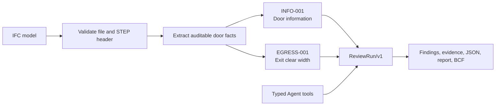

<div align="center">

# BIM Review Agent

**Evidence-first IFC review for catching door-information and egress-width issues before handoff.**

[](https://github.com/GreatAndyC/bim-review-agent/actions/workflows/ci.yml)
[](LICENSE)

[简体中文](README.md) · [English](README.en.md)

</div>

> [!IMPORTANT]
> This is a runnable BIM pre-check and evidence organiser, not a statutory compliance certificate or professional sign-off. The current slice deliberately reports uncertainty as `REVIEW` instead of guessing.


## What does it review?

The product accepts an IFC model, extracts auditable door facts, and runs two deterministic checks. Every finding links its status to model evidence, source paths, rule parameters, and a recommended next step.

| Check | What it inspects | Decision boundary |
| --- | --- | --- |
| `INFO-001` — Door information evidence | `IfcDoor.Name`, `Pset_DoorCommon.FireExit`, and `Pset_DoorCommon.FireRating` for confirmed exit doors | Missing or unusable values become `REVIEW`; the tool does not infer design intent from a name or tag |
| `EGRESS-001` — Exit-door clear width | Explicit clear-opening width for doors explicitly classified as exits | Compares the reported width with the selected rule profile; `IfcDoor.OverallWidth` is only a nominal proxy and never silently becomes clear width |

The bundled HKU demonstration profile uses a `900 mm` clear-width threshold. Additional versioned profiles are included for a Hong Kong fire-safety pre-check and a Mainland China `GB 55037-2022` pre-check. Those profiles are evidence aids, not legal certification.

The result is a canonical `ReviewRun/v1` with:

- `PASS` when the applicable evidence satisfies the configured rule;
- `FAIL` when explicit evidence does not satisfy it; and
- `REVIEW` when evidence is missing, ambiguous, contradictory, or only a proxy.

It currently does not perform full geometry clash detection, escape-route distance analysis, quantity take-off, or general building-code certification.

## Installation

There are two runnable surfaces. The Site-native app is the primary product UI; the Python package is the deterministic reference evaluator and local CLI.

### Recommended: run the product locally

Prerequisites: Node.js `>=22.13.0` and npm.

```bash
git clone https://github.com/GreatAndyC/bim-review-agent.git
cd bim-review-agent/apps/gpt-sites
npm ci
npm run dev
```

Open [http://localhost:3000](http://localhost:3000). Choose a bundled sample to see the review flow, or upload an IFC file from the workbench.

The default local path runs with the deterministic scripted Provider. It does not require an AI API key, a Python web server, or an external BIM service.

### Python reference CLI

Prerequisites: Python `>=3.11,<3.15` and [uv](https://docs.astral.sh/uv/).

From the repository root:

```bash
uv sync --extra dev
uv run bim-review-agent review \
  src/bim_review_agent/assets/samples/mixed_review.ifc \
  --profile demo_hku \
  --output /tmp/bim-review.json
```

The CLI also supports schema validation:

```bash
uv run bim-review-agent validate-schema \
  src/bim_review_agent/assets/samples/mixed_review.ifc
```

The Python runtime is intentionally CLI/reference-only. There is no longer a Python web server command.

## Try the canonical sample

After `npm run dev`, the Site API can run the same sample without opening the browser:

```bash
curl -sS -X POST \
  http://localhost:3000/api/agent-runs/sample/mixed_review \
  -H 'X-BIM-Review-Session: local-demo-session-0123456789'
```

The response contains a typed `agent_run`, its linked canonical `review_run`, and a one-time access envelope for JSON, quick-check, print, and deletion routes. The checked-in `mixed_review.ifc` golden result is:

```text
8 PASS · 1 FAIL · 4 REVIEW · 13 findings
```

The five bundled samples cover a clean baseline, a narrow exit, proxy-only width, missing information, and mixed evidence. The browser also supports sequential multi-file review with an aggregate quick-check report.

## How the review works



The Agent is an orchestration layer around typed tools. It can inspect the model, request the deterministic review, and critique evidence. It cannot write a verdict, change a threshold, or replace the canonical `ReviewRun`.

## Runtime boundary

| Surface | Role | Main technology |
| --- | --- | --- |
| `apps/gpt-sites` | Primary browser product, IFC upload, Site API, Agent run, expiring result storage | React 19, TypeScript, Vinext/Vite, `web-ifc`, Cloudflare Worker/D1 |
| `src/bim_review_agent` | Reference evaluator, local CLI, contract/golden generator, optional local Agent infrastructure | Python, IfcOpenShell, Pydantic |
| `contracts/` | Cross-runtime schemas, rule packs, sample manifest, deterministic golden projections | JSON |

Raw IFC bytes in the Site path are bounded in memory and are not retained. Derived Agent/Review JSON may be retained for 24 hours behind a one-time opaque access token. The local Python path writes only when an output path or configured memory store is explicitly used.

## Supported rule profiles

- `demo_hku` / `hku-demo-2026`: two-rule assessment demonstration, `900 mm` clear-width threshold.
- `hk-fire-safety-2011-2024`: Hong Kong means-of-escape evidence profile using the checked-in source mapping.
- `cn-fire-55037-2022`: Mainland China fire-safety evidence profile using the checked-in source mapping.

Profile parameters and authority limitations are versioned under [`src/bim_review_agent/assets/rules`](src/bim_review_agent/assets/rules) and [`contracts/rules`](contracts/rules). A profile is a configured pre-check, not a substitute for the project’s approved code interpretation.

## Verification

Python reference runtime:

```bash
uv run ruff check src scripts tests
uv run ruff format --check src scripts tests
uv run pytest -q
uv build
```

Site runtime:

```bash
cd apps/gpt-sites
npm run typecheck
npm run lint
npm test
```

The Site test command builds the Worker, checks the rendered surface, exercises upload boundaries, compares Site results with Python goldens, and runs the Workerd/D1 smoke path. See [`apps/gpt-sites/README.md`](apps/gpt-sites/README.md) for the full endpoint and deployment boundary.

## Project status

Implemented in the current assessment slice:

- real IFC parsing in both the Python reference path and Site-native WebAssembly path;
- deterministic `INFO-001` and `EGRESS-001` checks with evidence-first `PASS`/`FAIL`/`REVIEW` semantics;
- bundled fixtures, cross-runtime golden comparisons, typed Agent/tool traces, quick-check JSON/Markdown, print-ready reports, and Python-reference BCF 2.1 issue export;
- localized React workbench, sample runs, real IFC upload, sequential batch review, result deletion, and bounded expiring Site storage.

Not yet implemented:

- full geometry-based clash detection or escape-route analysis;
- resumable Agent execution, approval workflows, authenticated permanent history, or production operations;
- complete jurisdiction-specific compliance coverage and professional sign-off.

The original assignment brief asked for a runnable Web prototype or Agent that accepts a model, implements one or two rules, presents useful evidence, and produces a repeatable demo. That baseline is documented in [`docs/source/HKU_ASSIGNMENT_BRIEF.md`](docs/source/HKU_ASSIGNMENT_BRIEF.md).

## Documentation

- [Site-native runtime and local API](apps/gpt-sites/README.md)
- [Agent architecture and current scope](docs/technical/AGENT_SYSTEM_ARCHITECTURE.md)
- [Implemented technical architecture](docs/technical/ARCHITECTURE.md)
- [Codebase structure](docs/technical/CODEBASE_STRUCTURE.md)
- [Cross-runtime contracts](contracts/README.md)
- [Security and privacy boundary](SECURITY.md)
- [Public repository boundary](PUBLIC_REPOSITORY.md)
- [Public prompts and Agent constraints](prompts/README.md)
- [Demo script and submission checklist](docs/demo/DEMO_SCRIPT.md)

## Security and responsible use

Treat IFC files and model properties as untrusted input. Keep API keys in the process environment, never in source files or sample models. The default scripted path makes no external inference calls. Review outputs explain the evidence found in the model; they do not certify that a building complies with law or replace a qualified reviewer.

## Contributing

Keep deterministic rule logic in the domain/runtime layers, keep cross-runtime shapes in `contracts/`, and add a fixture plus golden projection for intentional semantic changes. Before opening a pull request, run the Python and Site verification commands above and explain any rule-pack, contract, or sample changes.

## License

MIT — see [`LICENSE`](LICENSE).
