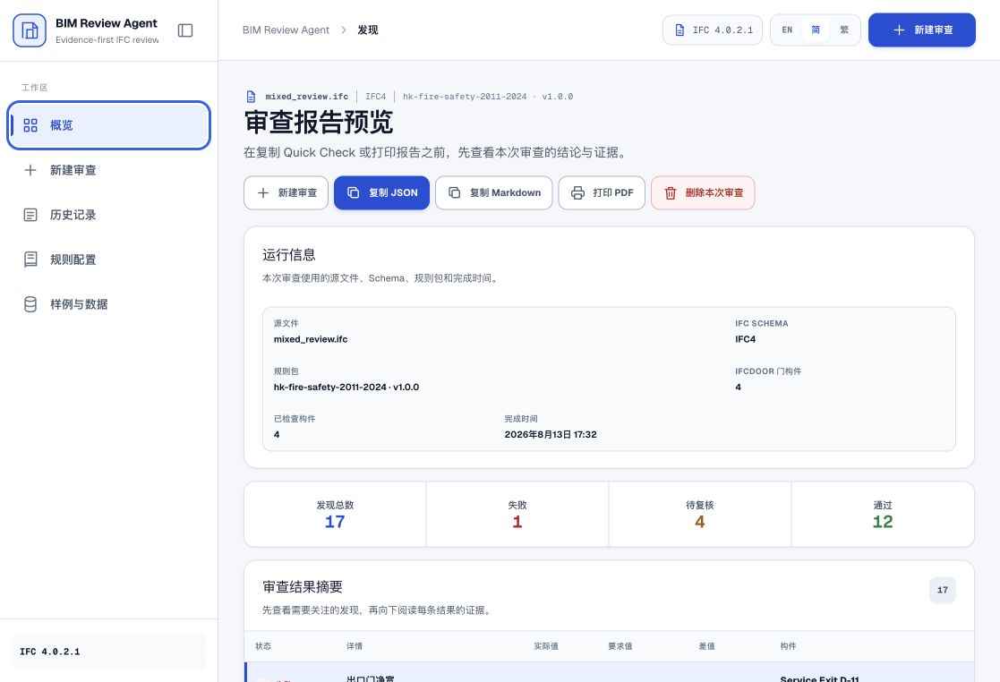
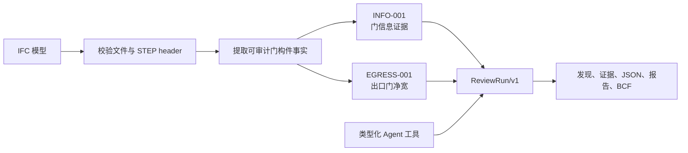

<div align="center">

# BIM Review Agent

**证据优先的 IFC 建筑模型预审工具：在交接前发现门信息和疏散净宽问题。**

[](https://github.com/GreatAndyC/bim-review-agent-public/actions/workflows/ci.yml)
[](LICENSE)

[简体中文](README.md) · [English](README.en.md)

</div>

> [!IMPORTANT]
> 这是一个可运行的 BIM 预审和证据整理原型，不是法定合规证书，也不能替代专业人员签字。当前版本对证据不足的情况明确返回 `REVIEW`，不会为了生成一个结论而猜测。



## 它检查什么？

产品接受 IFC 建筑模型，提取可追溯的门构件事实，并执行两条确定性规则。每条发现都连接到模型证据、字段路径、规则参数和建议下一步。

| 检查 | 检查内容 | 判定边界 |
| --- | --- | --- |
| `INFO-001` — 门信息证据完整性 | `IfcDoor.Name`、`Pset_DoorCommon.FireExit`，以及已确认出口门的 `Pset_DoorCommon.FireRating` | 缺失、为空或不可用时返回 `REVIEW`；不会仅凭名称或标签推断设计意图 |
| `EGRESS-001` — 出口门净宽 | 已明确标记为出口门的显式净开口宽度 | 与所选规则 profile 的阈值比较；`IfcDoor.OverallWidth` 只作为名义 proxy，不会静默当成净开口宽度 |

当前仓库包含 HKU 演示 profile（净宽阈值 `900 mm`）、香港消防安全预审 profile，以及基于 `GB 55037-2022` 的中国大陆消防安全证据 profile。它们都是版本化的证据辅助配置，不是法律认证引擎。

结果是规范化的 `ReviewRun/v1`：

- `PASS`：适用证据满足配置规则；
- `FAIL`：充分的显式证据确认存在规则短板；
- `REVIEW`：证据缺失、含糊、矛盾、无单位或只有 proxy，需要人工复核。

当前版本不做完整的几何碰撞检测、疏散路线距离分析、工程量算量或通用建筑法规认证。

## 安装运行

仓库包含两个运行面：Site-native 应用是主要产品 Web 界面；Python 包是确定性参考评估器和本地 CLI。

### 推荐：运行产品 Web 界面

环境要求：Node.js `>=22.13.0` 和 npm。

```bash
git clone https://github.com/GreatAndyC/bim-review-agent-public.git
cd bim-review-agent/apps/gpt-sites
npm ci
npm run dev
```

打开 [http://localhost:3000](http://localhost:3000)。可以选择仓库内置样例查看审查流程，也可以在工作台上传自己的 IFC 文件。

默认本地路径使用确定性的 scripted Provider，不需要 AI API Key、Python Web Server 或外部 BIM 服务。

### Python 参考 CLI

环境要求：Python `>=3.11,<3.15` 和 [uv](https://docs.astral.sh/uv/)。在仓库根目录运行：

```bash
uv sync --extra dev
uv run bim-review-agent review \
  src/bim_review_agent/assets/samples/mixed_review.ifc \
  --profile demo_hku \
  --output /tmp/bim-review.json
```

也可以只验证 IFC Schema：

```bash
uv run bim-review-agent validate-schema \
  src/bim_review_agent/assets/samples/mixed_review.ifc
```

Python 运行时现在明确是 CLI/reference-only，不再提供 Python Web Server 命令。

## 运行一个标准样例

启动 `npm run dev` 后，可以直接通过 Site API 运行标准样例，不必打开浏览器：

```bash
curl -sS -X POST \
  http://localhost:3000/api/agent-runs/sample/mixed_review \
  -H 'X-BIM-Review-Session: local-demo-session-0123456789'
```

响应包含类型化的 `agent_run`、它关联的规范 `review_run`，以及用于 JSON、Quick Check、打印和删除路由的一次性访问 envelope。仓库内置 `mixed_review.ifc` 的 golden 结果为：

```text
8 PASS · 1 FAIL · 4 REVIEW · 13 findings
```

内置样例覆盖 clean baseline、narrow exit、proxy-only width、missing information 和 mixed evidence。浏览器工作台还支持在同一新建审查入口中顺序处理多个 IFC，并生成批量 Quick Check 摘要。

## 审查是如何工作的？



Agent 是围绕类型化工具的编排层：它可以检查模型、请求确定性审查并复核证据，但不能直接写入 verdict、修改阈值或替代规范 `ReviewRun`。

## 运行边界

| 目录 / 运行面 | 作用 | 主要技术 |
| --- | --- | --- |
| `apps/gpt-sites` | 主要浏览器产品、IFC 上传、Site API、Agent 运行和有期限的结果存储 | React 19、TypeScript、Vinext/Vite、`web-ifc`、Cloudflare Worker/D1 |
| `src/bim_review_agent` | 参考评估器、本地 CLI、契约/golden 生成和可选本地 Agent 基础设施 | Python、IfcOpenShell、Pydantic |
| `contracts/` | 跨运行时 Schema、规则包、样例清单和确定性 golden 投影 | JSON |

Site 路径中的原始 IFC 只在有界内存中处理，不会被持久化。派生的 Agent/Review JSON 可以通过一次性 opaque token 在 24 小时内访问。Python 路径只有在显式传入输出路径或配置 memory store 时才写入文件。

## 支持的规则 profile

- `demo_hku` / `hku-demo-2026`：HKU 能力测试演示 profile，净宽阈值 `900 mm`。
- `hk-fire-safety-2011-2024`：香港疏散安全证据 profile，使用仓库内已核对的来源映射。
- `cn-fire-55037-2022`：中国大陆消防安全证据 profile，使用仓库内已核对的来源映射。

profile 参数和权威边界位于 [`src/bim_review_agent/assets/rules`](src/bim_review_agent/assets/rules) 与 [`contracts/rules`](contracts/rules)。profile 是配置化预审，不替代项目批准的规范解释。

## 验证命令

Python 参考运行时：

```bash
uv run ruff check src scripts tests
uv run ruff format --check src scripts tests
uv run pytest -q
uv build
```

Site 运行时：

```bash
cd apps/gpt-sites
npm run typecheck
npm run lint
npm test
```

Site 测试会构建 Worker，检查 SSR/渲染界面，验证上传边界，比较 Site 与 Python golden 结果，并运行 Workerd/D1 集成路径。完整边界见 [`apps/gpt-sites/README.md`](apps/gpt-sites/README.md)。

## 当前完成度

当前能力测试切片已经实现：

- Python 参考路径和 Site-native WebAssembly 路径都可以解析真实 IFC；
- `INFO-001` 和 `EGRESS-001` 两条确定性规则，以及证据优先的 `PASS / FAIL / REVIEW` 语义；
- 内置 fixtures、跨运行时 golden 比较、类型化 Agent/tool trace、Quick Check JSON/Markdown、打印报告和 Python 参考 BCF 2.1 issue export；
- 多语言 React 工作台、样例运行、真实 IFC 上传、批量审查、结果删除和有期限的 Site 存储。

尚未实现：

- 完整几何碰撞检测或疏散路线距离分析；
- 可恢复的 Agent 执行、审批流、登录后的永久历史和生产运维体系；
- 完整的司法辖区规范覆盖与专业签字。

最初的 HKU 作业要求、范围和验收边界见 [`docs/source/HKU_ASSIGNMENT_BRIEF.md`](docs/source/HKU_ASSIGNMENT_BRIEF.md)。

## 文档入口

- [英文 README](README.en.md)
- [Site-native runtime 与本地 API](apps/gpt-sites/README.md)
- [Agent 系统架构与当前范围](docs/technical/AGENT_SYSTEM_ARCHITECTURE.md)
- [技术架构](docs/technical/ARCHITECTURE.md)
- [代码库结构](docs/technical/CODEBASE_STRUCTURE.md)
- [跨运行时契约](contracts/README.md)
- [安全与隐私边界](SECURITY.md)
- [公开仓库边界](PUBLIC_REPOSITORY.md)
- [公开提示词与 Agent 约束](prompts/README.md)
- [完整 Prompt 历史（已脱敏）](docs/PROMPT_HISTORY.md)
- [当前演示脚本与提交清单](docs/demo/DEMO_SCRIPT.md)
- [当前视频 QA 报告](docs/demo/VIDEO_QA_REPORT_2026-08-13.md)

## 安全与负责使用

把 IFC 文件和模型属性当作不可信输入。API Key 只放在进程环境变量中，不要写进源码或样例模型。默认 scripted 路径不调用外部推理服务。审查结果解释模型中找到的证据，不证明建筑符合法律，也不能替代具备资质的专业审查人员。

## 贡献约定

确定性规则放在 domain/runtime 层，跨运行时结构放在 `contracts/`，有意改变语义时同时添加 fixture 和 golden projection。提交 Pull Request 前，请执行上面的 Python 与 Site 验证命令，并说明规则包、契约或样例的变化。

## 许可证

MIT，详见 [`LICENSE`](LICENSE)。
