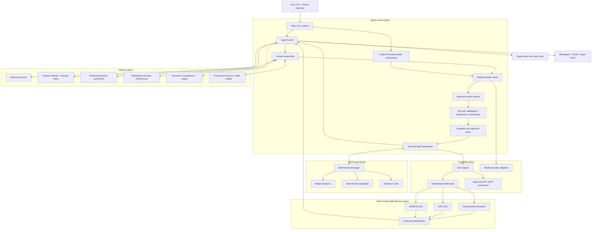
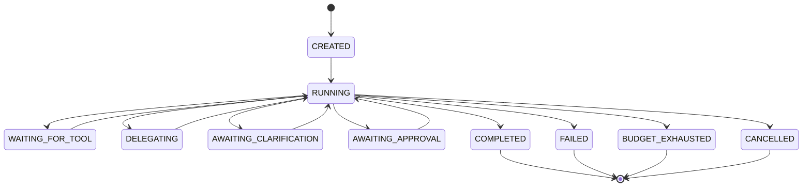

# BIM Review Agent System Architecture

| Field | Value |
|---|---|
| Version | 0.3 |
| Status | Assessment vertical slice implemented; production extensions staged |
| Owner | Repository owner |
| Last updated | 2026-08-09 |
| Assessment deadline | 2026-08-13 23:00 HKT (`UTC+08:00`) |

## 1. Purpose

This document defines the architecture of the first full Agent system designed in this repository. The product is not intended to be a fixed review pipeline with an “Agent” label. It is intended to become a bounded, inspectable BIM Agent platform with:

- a model-driven Agent loop;
- working, session, and durable memory;
- multiple specialist Agents coordinated by a manager;
- model-provider and API-connector registries;
- dynamic discovery and selection of permitted tools;
- explicit permissions, budgets, and stopping conditions;
- typed events and evidence-first observability; and
- a deterministic BIM compliance kernel that retains verdict authority.

The repository now contains the deterministic BIM kernel, a browser workbench for baseline/single-Agent/Manager-team execution, a provider-independent Agent loop, three explicit memory layers (per-run working state, allowlisted semantic preferences, and scoped redacted episodes), manager-owned orchestration of three isolated BIM specialists, a fail-closed Provider registry, optional OpenAI Responses and OpenRouter adapters, a ten-model OpenRouter allowlist with explicit refresh, a first-run model onboarding and persistent switcher, a separate Connector registry with inherited per-run capability selection, and a public runtime/event inspector. It does **not yet** implement every production extension below. That distinction is intentional and must remain visible in the README, user interface, and demonstration.

## 2. Architectural thesis

An Agent system needs a stable architecture in the same way that a general computer needs a processor, memory, instructions, I/O, and a control path. The analogy is useful but not exact:

| Computer concept | Agent-system counterpart | BIM Review Agent responsibility |
|---|---|---|
| Control unit | Agent kernel and run loop | Advances the run, dispatches calls, enforces stopping conditions |
| Processing unit | Model runtime | Interprets goals, selects actions, synthesizes bounded outputs |
| Main memory | Working memory | Holds the current objective, typed tool observations, produced references, and budget state for one run |
| Persistent storage | Session, semantic, and episodic memory | Retains scoped session identity, approved preferences, and redacted terminal summaries |
| Instruction set | System policy, Agent definitions, and skills | Defines roles, constraints, available procedures, and expected outputs |
| I/O devices | Tools, APIs, files, and MCP connectors | Exposes IFC parsing, rule execution, reports, and approved external services |
| System bus | Typed messages and events | Carries model requests, tool calls, results, delegations, and lifecycle events |
| Scheduler | Multi-Agent orchestrator | Assigns bounded tasks, limits concurrency, and gathers specialist results |
| Privilege boundary | Capability and approval policy | Restricts which Agent may use which tool, data, provider, or side effect |

The architecture separates two kinds of authority:

1. **Control authority:** the manager Agent may decide which permitted tool or specialist to use next.
2. **Verdict authority:** only deterministic BIM rule code may create or change `PASS`, `FAIL`, or `REVIEW`.

This separation is the central design decision. It creates real Agent behaviour without allowing probabilistic prose generation to become a compliance calculator.

### 2.1 Implemented system mapping

The computer-architecture analogy is reflected in concrete modules, not only in documentation:

| Agent subsystem | Implemented component | Assessment status |
|---|---|---|
| Control unit | Budgeted `agent/kernel.py` model → typed action → observation loop | Implemented |
| Instruction set | Pydantic action schemas, Agent definitions, tool/specialist allowlists | Implemented |
| Volatile memory | Current objective, typed observations, produced review IDs, and budgets inside one `AgentRun` | Implemented |
| Persistent memory | SQLite semantic preferences plus scoped redacted episodes with retention and hard forget | Implemented |
| Processing/runtime choice | Local scripted Provider plus opt-in Responses and allowlisted OpenRouter adapters behind one protocol | Implemented; live inference evaluation staged |
| I/O bus | Provider requests, Connector-filtered tool schemas, typed observations, and public events | Implemented |
| Scheduler | Manager-owned delegation to three isolated specialists with bounded concurrency | Implemented |
| Trusted domain processor | IfcOpenShell fact extraction plus versioned deterministic BIM rules | Implemented |
| Process checkpointing | Persisted message/task/approval state capable of resuming an interrupted call | Staged |
| Privileged external I/O | Reviewed HTTP/MCP/Revit/CDE adapters with interactive approval | Staged |

Therefore the assessment claim is not feature parity with Codex, Claude Code, or Hermes. It is a narrow, runnable vertical slice of the same recurring Agent-system layers, with explicit omissions.

## 3. Current implementation versus target system

### 3.1 Current implementation

The current `review_ifc_bytes()` path always performs the same sequence:

1. validate the upload;
2. extract IFC facts;
3. read enabled YAML rules;
4. execute `INFO-001` and `EGRESS-001`;
5. attach deterministic explanations; and
6. assemble a `ReviewRun`.

It already provides valuable Agent-system foundations:

- deterministic domain tools;
- typed evidence and result schemas;
- an observable stage trace;
- explicit uncertainty through `REVIEW`;
- versioned rule configuration;
- bounded in-memory result retention; and
- multiple projections from one canonical run.

The first Agent slice additionally provides:

- a provider-independent model-action contract;
- a budgeted tool/observation loop;
- registered `inspect_model` and `run_deterministic_review` capabilities;
- observation- and objective-dependent branching;
- typed public events and terminal stop reasons;
- bounded in-memory `AgentRun` retention;
- an offline scripted Provider for reproducible trajectory tests;
- public Provider availability metadata and explicit request routing;
- a disabled-by-default Responses API adapter tested without a live network call;
- a disabled-by-default OpenRouter Chat adapter with shared typed-action validation;
- a dated, network-free ten-model fallback plus explicit atomic refresh of tool-capable `top-weekly` models;
- validated per-run `model_id` selection across single-/multi-Agent sample and upload paths;
- credential-free Connector metadata, explicit selection, and capability filtering;
- inherited `connector.selected` provenance for Manager and specialist runs;
- working memory within each run;
- SQLite semantic preferences with exact user/project scope, provenance, correction, and hard forget;
- SQLite sessions with bounded redacted episodes, newest-first recall, retention caps, and cascade forget;
- `session.selected` and `episode.recalled` public provenance plus run/session/episode IDs;
- browser onboarding plus objective, Provider, Model, Connector, semantic-memory, and session-memory controls;
- separate public `AgentRun` and canonical `ReviewRun` projections; and
- a no-private-chain-of-thought event timeline and Manager/specialist topology.

### 3.2 Remaining Agent-system gaps

| Capability | Current state | Target state |
|---|---|---|
| Model-driven loop | Provider contract, scripted loop, and two optional function-calling adapters implemented; live inference behaviour is unmeasured | Add clarification/pause actions, streaming, and production model evaluation |
| Dynamic planning | Two bounded branches use objective and IFC observation | The Agent selects among broader permitted checks and specialists |
| Tool registry | Typed registry plus Connector-filtered materialization implemented for three BIM capabilities | Add more approved capability groups and per-tool approval modes |
| Provider registry | Scripted, Responses, and OpenRouter adapters expose enabled/configured/availability metadata; OpenRouter adds a dynamic ten-model allowlist; manual selection and local-only `auto` implemented | Add active health/rate-limit probes, enforced run-level cost ceilings, and approved fallback classes |
| API connectors | `local-bim` available; HTTP disallowed and MCP disabled placeholders expose policy/health without handlers | Add separately reviewed typed HTTP/MCP/Revit/CDE adapters and active health probes |
| Session state | Stable scoped session IDs and bounded terminal episode summaries persist in SQLite; full runs/events remain process-local | Add resumable execution checkpoints with messages, task graph, pending calls, pause, and approval state |
| Durable memory | SQLite semantic preferences plus redacted same-session episodic recall, provenance, retention caps, and hard forget implemented | Add expiry controls, relevance retrieval beyond newest-first session recall, and procedural discovery |
| Multi-Agent | Manager, three isolated BIM specialists, two-child concurrency, structured aggregation, and child runs implemented | Add pause/resume, cooperative cancellation, and production scheduling |
| Skills/procedures | Prompt files only | Versioned, discoverable review procedures separate from hard verdict logic |
| Approvals | Static Connector approval metadata enforced; no interactive pause/resume | Add user approval for external, costly, mutating, or sensitive actions |
| Agent evaluation | Scripted trajectory, memory, multi-Agent, Provider routing, both fake-transport adapters, model-catalogue policy, schema, and budget tests implemented | Add live-provider quality/cost evaluation and broader safety evals |
| Agent experience | Browser mode/objective/Provider/Model/Connector controls, three-step onboarding, three-layer memory workbench, clean/forget session actions, and terminal runtime inspector implemented | Add streaming, active-run progress, clarification, approval, checkpoint resume, and cancellation |

## 4. Reference architecture



## 5. Agent kernel

### 5.1 Responsibilities

The Agent kernel owns orchestration mechanics, not domain verdicts. The list below is the full target contract; the assessment slice implements creation, context assembly, Provider invocation, typed dispatch, memory recall, budgets, events, and terminal outcomes, while resume/approval/clarification remain staged. It must:

- create or resume an `AgentRun`;
- assemble the permitted context for the current Agent;
- invoke a selected model provider;
- validate model outputs against declared schemas;
- dispatch permitted tool calls and delegations;
- append structured observations to run state;
- retrieve relevant memory without silently treating it as fact;
- enforce iteration, token, time, cost, concurrency, and retry budgets;
- pause for approval or clarification when required;
- persist public events without persisting private chain-of-thought;
- terminate with an explicit stop reason; and
- return a typed final result linked to the canonical `ReviewRun`.

### 5.2 Core loop

```text
create_or_resume_run()
load_agent_definition()
retrieve_allowed_memory()
discover_allowed_tools_and_specialists()

while budget remains:
    response = model.next(context, tools, specialists)

    if response requests clarification:
        pause(CLARIFICATION_REQUIRED)

    if response requests approval-gated action:
        pause(APPROVAL_REQUIRED)

    if response requests tool calls:
        validate_and_execute_calls()
        append_tool_observations()
        continue

    if response delegates tasks:
        schedule_bounded_specialists()
        append_specialist_results()
        continue

    if response returns final output:
        validate_final_contract()
        complete(FINAL_OUTPUT)

stop(BUDGET_EXHAUSTED or ERROR)
```

The kernel must never infer that silence means success. Every run ends with a typed stop reason.

### 5.3 Lifecycle states



## 6. Agent definitions and roles

Every Agent is a typed definition, not just a prompt string.

### 6.1 `AgentDefinition`

Required fields:

- stable `agent_id` and display name;
- version;
- concise role description;
- system instructions;
- allowed tool and connector categories;
- denied capabilities;
- model requirements and preferred routing class;
- input and output schemas;
- memory read/write policy;
- delegation targets;
- maximum steps, retries, duration, and parallel children; and
- approval policy.

### 6.2 Initial Agent team

| Agent | Responsibility | Allowed capabilities | Prohibited behaviour |
|---|---|---|---|
| BIM Review Manager | Own the user objective, select specialists, and produce the final response | Read review context, delegate, request deterministic checks, read specialist summaries | Create or edit verdicts; write new rule thresholds |
| Model Inspector | Inspect schema, units, entity inventory, and evidence availability | IFC inventory and fact-query tools | Assign compliance status |
| Rule Review Specialist | Select and run enabled deterministic BIM checks | Rule catalogue, `INFO-001`, `EGRESS-001`, finding lookup | Generate executable rules from prose; override rule packs |
| Evidence Critic | Challenge whether conclusions are supported and identify unresolved uncertainty | Read-only findings, evidence, rule metadata | Change findings or introduce new authority |

The assessment slice uses a **manager-as-owner** pattern. Specialists behave like bounded tools and return structured results; they do not take over the user conversation. This keeps one final accountable Agent and makes delegation visible.

### 6.3 Delegation contract

Every delegated task contains:

- parent run and task IDs;
- specialist Agent ID and version;
- a bounded objective;
- a filtered context reference rather than the full parent history;
- an explicit tool allowlist;
- a structured output schema;
- time, step, token, and retry budgets; and
- a cancellation signal.

Specialists may not create nested specialists in the assessment implementation. The manager may run independent read-only specialists concurrently, with a default maximum of two.

## 7. Memory architecture

Memory is a subsystem with provenance and policy. It is not an unbounded transcript dump and it is not a substitute for checked-in requirements.

### 7.1 Memory types

| Type | Lifetime | Examples | Injection policy |
|---|---|---|---|
| Working memory | One Agent run | Current objective, selected file reference, pending tasks, tool observations | Always available to the owning run |
| Session memory | Multiple terminal runs in one exact user/project scope | Stable session identity and ordered episode index; no transcript dump | Selected explicitly or reopened by the browser |
| Episodic memory | Across runs in one session | Source/objective fingerprints, runtime selections, terminal mode/state, aggregate counts, run references | Newest three safe summaries recalled; 20 retained per session |
| Semantic memory | Across sessions | Allowlisted explanation language and default review mode | Retrieved by exact user/project scope and precedence |
| Procedural memory | Versioned target capability | Review playbooks, tool-use instructions, evidence-checking procedures | Future on-demand skill discovery; not implemented in this slice |

### 7.2 `MemoryRecord`

The target generic durable record should include:

- stable ID;
- memory type;
- scope: user, project, model, rule pack, or session;
- content and optional structured payload;
- source event/run ID;
- creator: user, system, or Agent;
- created and last-used timestamps;
- confidence and verification state;
- sensitivity classification;
- expiry or retention policy;
- supersession link; and
- whether user approval is required before future use.

### 7.3 Memory safety rules

- Never store API keys, tokens, authentication headers, or secrets.
- Do not persist raw IFC bytes by default.
- Do not convert a prior Agent statement into verified BIM evidence.
- Checked-in rule packs and project policy override remembered preferences.
- Memory may affect presentation, routing, and default scope; it may not silently change a verdict threshold.
- Every recalled memory shown to a model retains source and scope metadata.
- Users can inspect, correct, disable, and delete durable memories.
- Sensitive or externally sourced context is excluded from automatic memory creation unless explicitly allowed.
- Source/objective hashes are correlation identifiers, not encryption; raw values remain excluded and hashes must not be presented as anonymization guarantees.

### 7.4 Assessment memory slice

The assessment implementation uses SQLite and demonstrates:

1. stable session continuity across completed single- and multi-Agent runs;
2. one durable preference such as explanation language;
3. one project-scoped preference such as the default enabled review scope;
4. provenance shown in the Agent trace; and
5. an explicit “forget” operation.

Raw IFC data and rule verdicts remain outside semantic preference memory.

Implemented now: all five assessment items. Semantic records support `explanation_language` and `default_review_mode` with exact scope and `memory.recalled` events. Session records retain at most 20 redacted episodes, recall at most the newest three, emit `session.selected` / `episode.recalled`, and can be hard-deleted with their episodes. Episode content is limited to hashes, IDs, selected runtime metadata, terminal state/mode, aggregate counts, timestamps, and recall provenance. Memory cannot change thresholds, evidence, or verdicts.

“Session continuity” here does not mean execution resumption. The system does not yet persist the provider message stack, pending task graph, approval state, or interrupted tool call required to resume a paused trajectory.

## 8. Tools, APIs, and connectors

### 8.1 Capability model

The Agent may choose among **configured and policy-approved** capabilities. It may not autonomously discover credentials, sign up for services, install arbitrary code, or call an unknown network endpoint.

```text
User or administrator configures connector
        ↓
Connector registry validates metadata and availability
        ↓
Policy filters capabilities for the current Agent and run
        ↓
Model sees only the permitted tool catalogue
        ↓
Agent selects a tool or API based on the objective and observations
```

This distinction preserves meaningful autonomy without giving a language model uncontrolled infrastructure authority.

### 8.2 Tool registry

Each `ToolDefinition` includes:

- stable name and version;
- description and category;
- typed input and output schemas;
- handler reference;
- read-only or mutating effect classification;
- data sensitivity and network requirements;
- required connector/provider capabilities;
- timeout and retry policy;
- idempotency metadata;
- approval mode;
- eligible Agent roles; and
- availability health.

Initial BIM tools:

| Tool | Purpose | Effect |
|---|---|---|
| `inspect_model` | Return schema, units, counts, and safe model metadata | Read-only |
| `list_review_rules` | Return enabled rules, authority, and parameters | Read-only |
| `run_information_review` | Execute `INFO-001` deterministically | Read-only computation |
| `run_egress_review` | Execute `EGRESS-001` deterministically | Read-only computation |
| `get_finding_evidence` | Retrieve model and rule evidence by finding ID | Read-only |
| `finalize_review` | Validate and seal the canonical run | Local state write |
| `render_report` | Project a sealed run into print HTML | Read-only projection |
| `export_bcf` | Serialize actionable findings | Read-only projection |

### 8.3 Connector registry

Connectors expose tool/API capability sources through a common contract. Target connector families are:

- built-in local Python tools;
- HTTP API adapters;
- future MCP servers; and
- future authoring-platform adapters such as Revit or a common data environment.

Connector configuration stores references to environment-variable names, never credential values in Git or public run traces.

Implemented assessment slice: `local-bim` is an available, healthy, network-free Connector that declares `inspect_model`, `run_deterministic_review`, and `critique_review_evidence`. `external-http` is registered as `DISALLOWED`, while `mcp-server` is `DISABLED`; both have empty capability sets and no executable handler or endpoint. Requests select Connector IDs independently from the model Provider. The resolver rejects unknown, oversized, empty, disabled, unavailable, disallowed, and capability-incomplete selections before the run starts. The Manager passes the same selected Connector IDs and capability set to every specialist child.

### 8.4 Tool discovery

The model should not receive every possible schema on every turn. The registry exposes a compact catalogue first, then resolves full schemas for relevant capability groups. Discovery is filtered by:

- Agent role;
- task type;
- effect and approval policy;
- data scope;
- provider tool-calling support;
- connector health; and
- remaining run budget.

## 9. Model provider architecture

### 9.1 Provider independence

The Agent kernel depends on a `ModelProvider` protocol rather than one vendor SDK. A provider adapter declares:

- provider and model ID;
- supported input/output modalities;
- native tool-calling support;
- structured-output support;
- context capacity;
- streaming and cancellation support;
- estimated cost class;
- configured credential reference;
- health and rate-limit state; and
- retry/fallback compatibility.

### 9.2 Provider selection

The user may choose a provider explicitly or select `auto`. Automatic routing evaluates only configured providers and uses a deterministic policy based on:

1. required capabilities;
2. Agent role and task complexity;
3. privacy policy;
4. availability and rate-limit state;
5. configured cost ceiling; and
6. administrator/user preference.

The selection and fallback reason are recorded in public trace metadata. A fallback provider must receive the same filtered context and capability policy.

Implemented assessment policy: `scripted` is the default, and `auto` deterministically resolves to `scripted` even when an external adapter is configured. Selecting `openai-responses` or `openrouter` requires explicit server opt-in, a credential in the process environment, and an explicit request. OpenRouter also requires a `model_id` in its current approved catalogue. Unknown, disabled, unavailable, fixed-Provider-mismatched, malformed, or catalogue-external selections fail closed; the application never silently crosses from local execution to an external service.

The browser exposes this policy through a native three-step onboarding and a persistent Provider/model switcher. First-run Skip, Close, or Escape retains local `scripted`; reopening uses Cancel without changing the current selection. Browser storage contains only onboarding completion plus selected Provider/model IDs—never credentials.

### 9.3 OpenRouter model catalogue

“Top 10” has one precise implemented meaning: the first ten entries in OpenRouter's `top-weekly` ordering that declare both `tools` and `tool_choice`. It is a popularity signal, not a BIM-quality benchmark.

- `OpenRouterCatalogueService.current()` reads an in-process snapshot and never opens a network connection.
- Startup uses a dated, checked-in ten-model snapshot so local onboarding remains deterministic and available when OpenRouter is unreachable.
- `POST /api/providers/openrouter/models/refresh` is the only live catalogue-refresh route. It validates ID, name, context length, prices, and required parameter metadata for all ten entries before one atomic replacement.
- A failed, malformed, or short refresh raises a structured recovery response and preserves the previous snapshot.
- Provider resolution reads the same current catalogue, so UI labels and the execution allowlist change together. A model that disappears on refresh cannot be used in a new run.
- Catalogue price fields are display metadata converted to USD per million tokens; they are not a spend estimate or billing guarantee.

### 9.4 Assessment provider slice

The assessment implementation includes:

- `ScriptedModelProvider` for deterministic trajectory tests;
- one optional OpenAI Responses function-calling adapter for a model-driven demonstration;
- one optional OpenRouter Chat Completions adapter instantiated for an approved per-run model;
- an `offline` mode that keeps the existing deterministic web review runnable;
- explicit “provider unavailable” behaviour; and
- no silent fallback from a local/private provider to an external provider.

Both external adapters are intentionally transport-injectable and normalize native function calls through one shared typed-action validator. Checked-in tests validate request construction, credential isolation, tool calls, parallel specialist calls, finalization, malformed output, unknown capabilities, and canonical review-link provenance against fake transports. They do not perform a paid/live inference request.

Both adapters send the current objective, allowlisted preferences, redacted recalled episodes, and safe structured observations rather than IFC bytes or prior prose. OpenAI requests `store: false`. OpenRouter requires parameter-compatible routing, sets `data_collection: "deny"`, and requires a ZDR-capable route. These settings reduce retention exposure but do not replace review of the selected provider's terms, jurisdiction, and current policy. All tool execution and verdict authority remain in the kernel.

## 10. State and public event contracts

### 10.1 `AgentRun`

An `AgentRun` links Agent behaviour to the canonical domain result. The implemented assessment record includes:

- run, session, saved-episode, and recalled-episode IDs;
- objective, timestamps, duration, and Agent definition/version;
- provider/model and Connector selections;
- lifecycle state and stop reason;
- step, tool, delegation, and concurrency budgets plus measured counts;
- embedded typed public events;
- semantic and episodic memory reads by record ID;
- delegated child run IDs;
- final structured response; and
- linked `ReviewRun` ID.

Token/cost/retry budgets, a persistent task graph, and approval/checkpoint state belong to the fuller target record and are not represented as implemented fields.

### 10.2 Public events

Implemented public events are append-only and typed:

- `run.started`;
- `session.selected`;
- `memory.recalled`;
- `episode.recalled`;
- `provider.selected`;
- `connector.selected`;
- `tool.discovered`;
- `provider.requested`;
- `tool.requested`;
- `tool.completed` or `tool.failed`;
- `agent.delegated`;
- `agent.completed` or `agent.failed`;
- `run.completed`, `run.failed`, or `run.budget_exhausted`.

Target checkpoint extensions add clarification, `approval.requested`, `approval.resolved`, and `run.cancelled` events when those lifecycle transitions become executable.

The interface shows concise action and observation summaries. Private chain-of-thought is neither requested nor stored.

## 11. Permissions and governance

### 11.1 Capability classes

| Class | Example | Default policy |
|---|---|---|
| Pure read | Inspect IFC inventory, read finding evidence | Allow within current run scope |
| Deterministic compute | Execute enabled review rule | Allow and trace |
| Local state write | Store approved memory, seal run | Allow only through validated handlers |
| External read | Query approved documentation/API | Require configured connector and trace |
| External write | Create issue, upload model, modify CDE | Require explicit user approval |
| Destructive or credential action | Delete data, reveal secret, change auth | Deny in assessment build |

### 11.2 Invariants

- Only deterministic rules create verdicts.
- Every tool call is schema-validated before execution.
- Every specialist receives a minimum necessary context and tool set.
- No Agent sees credential values.
- External access is disabled unless a configured connector is explicitly enabled.
- Cost, time, steps, retries, and concurrency have hard limits.
- Approval-gated work pauses and resumes the same run rather than pretending completion.
- An Agent failure cannot fabricate a successful `ReviewRun`.

## 12. Evaluation strategy

### 12.1 Deterministic kernel regression

The existing planted IFC cases remain the verdict oracle. Adding Agent behaviour must not change their expected findings.

### 12.2 Agent trajectory tests

Use `ScriptedModelProvider` fixtures to assert:

- the manager requests model inspection before evidence-dependent conclusions;
- only allowed tools are dispatched;
- a tool observation can change the next requested action;
- malformed tool arguments are rejected;
- repeated or looping calls hit a budget stop;
- specialist results are returned to the manager in a bounded schema;
- the manager cannot edit a specialist or deterministic rule verdict;
- provider failure follows the declared fallback policy; and
- the final Agent result links to exactly one sealed `ReviewRun`.

### 12.3 Memory tests

- A stable session recalls only safe summaries of prior terminal runs, not raw models or transcript bodies.
- Session scope mismatch fails closed, newest-first recall is capped at three, and retention is capped at 20 sessions per scope / 20 episodes per session.
- Forgetting a session hard-deletes its episodes; starting a clean session recalls none.
- A durable preference is recalled only in the matching scope.
- A corrected memory supersedes the old record.
- A forgotten record is no longer retrieved.
- Secret-like values are rejected or redacted.
- Memory never overrides a checked-in rule parameter.

### 12.4 Multi-Agent tests

- The manager delegates only to registered specialists.
- Context filtering excludes unrelated messages and raw IFC bytes.
- Concurrency never exceeds the configured cap.
- Child failure propagation is tested; cooperative cancellation remains a target test with the staged cancellation feature.
- Child failures are visible and do not become fabricated success.
- Results are deterministic when the scripted provider trajectory is fixed.

### 12.5 Measurable acceptance targets

| Measure | Target |
|---|---:|
| Existing planted-case verdict agreement | 100% |
| Unauthorized tool dispatches in scripted safety cases | 0 |
| Agent trajectories ending with an explicit stop reason | 100% |
| Specialist responses passing their declared schema | 100% in checked-in fixtures |
| Durable-memory records with provenance and scope | 100% |
| Session/episode retention, isolation, and hard-forget cases | 100% of checked-in cases |
| Tests requiring paid/live model calls | 0 |
| OpenRouter models accepted outside the current ten-model allowlist | 0 |
| Automatic catalogue-network calls during page load/current-snapshot reads | 0 |
| External secrets committed or emitted in traces | 0 |

## 13. Delivery slices

### Slice 0 — Deterministic BIM kernel (implemented)

- IFC validation and fact extraction;
- `INFO-001` and `EGRESS-001`;
- canonical `ReviewRun`;
- evidence workspace, JSON, report, and BCF;
- deterministic tests and sample models.

### Slice 1 — Agent kernel and tool registry (implemented vertical slice)

- typed `AgentDefinition`, `AgentRun`, events, and stop reasons;
- scripted provider;
- tool discovery, dispatch, budgets, and public trace;
- existing BIM functions exposed as registered tools.

The checked-in implementation uses `inspect_model` and `run_deterministic_review`, an offline scripted Provider, `/api/agent-runs` endpoints, in-memory Agent-run retention, and a browser runtime inspector. Explicit Provider routing is implemented in Slice 4.

### Slice 2 — Persistent memory (assessment slice implemented)

- SQLite session and durable-memory records;
- scoped recall, provenance, correction, and forget operation;
- memory policy visible in the UI.

The SQLite preference store, scoped recall, provenance, correction chain, and hard forget are implemented. Scoped sessions, bounded redacted episode records, newest-three recall, retention pruning, cascade forget, cross-mode continuation, capability metadata, API/browser controls, and Agent-trace injection are also implemented. Resumable execution checkpoints and transcript/task restoration remain staged.

### Slice 3 — Multi-Agent orchestration (assessment vertical slice implemented)

- manager plus Model Inspector, Rule Review Specialist, and Evidence Critic;
- bounded manager-as-owner delegation;
- isolated context and concurrency cap;
- structured specialist result aggregation.

The generic kernel validates typed delegation tasks, Agent allowlists, total/parallel budgets, and exact task/result matching. The concrete scheduler runs Model Inspector and Rule Review Specialist concurrently, then runs Evidence Critic against the resulting canonical review. Each child uses one role-specific tool, receives no parent transcript or memory, cannot delegate, and remains independently inspectable. Pause/resume and cooperative cancellation remain staged.

### Slice 4 — Provider and Connector selection (local assessment slice implemented)

- provider registry and `auto`/manual routing;
- two optional real provider adapters;
- an explicit, atomically refreshed model catalogue and per-run model allowlist;
- connector metadata and health;
- explicit offline and unavailable states.

Implemented now: a credential-free Provider catalogue, deterministic local-only `auto`, explicit `provider_id` / `model_id` selection on single- and multi-Agent sample/upload endpoints, disabled/unavailable errors with recovery guidance, an optional Responses API adapter, and an optional OpenRouter adapter restricted to the current tool-capable weekly Top 10. The initial model snapshot is network-free; explicit refresh validates and atomically replaces it. A separate Connector catalogue exposes type/effect/network/approval/availability/health metadata, selects approved sources per run, filters instantiated tools, and preserves inherited child-run provenance. Active health probes, interactive approval gates, and executable external HTTP/MCP connectors remain staged.

### Slice 5 — Experience and evaluation (assessment UI implemented; video staged)

- objective input and Agent-mode controls;
- memory and Provider/model controls plus first-run onboarding;
- inspectable tool/delegation timeline;
- scripted trajectory, memory, multi-Agent, and safety evaluations;
- updated three-minute demonstration.

Implemented now: mode-aware browser execution, a skippable/backable/reopenable three-step model onboarding, objective/Provider/Model/Connector selection, non-sensitive preference persistence, separate working/semantic/episodic memory panels, clean-session and hard-forget controls, Manager-owned output, specialist topology, public terminal events, explicit inventory-only empty state, linked canonical findings, responsive layout, dark mode, and browser interaction checks. Updating/recording the sub-three-minute demonstration remains staged.

The architecture is deliberately larger than the assessment implementation. The assessment delivers a narrow but real vertical slice through the kernel, memory, delegation, Provider routing, local Connector policy, and observable user experience rather than claiming every production capability is complete.

## 14. Implemented repository structure

```text
src/bim_review_agent/
├── domain/
│   ├── models.py
│   ├── ifc/
│   ├── rules/
│   └── exports/
├── application/
│   ├── review_service.py
│   ├── agent/
│   │   ├── kernel.py
│   │   ├── schemas.py
│   │   ├── registry.py
│   │   ├── bim_review.py
│   │   ├── multi_agent_review.py
│   │   ├── intent.py
│   │   └── orchestration/
│   │       ├── base.py
│   │       ├── bim.py
│   │       └── specialists.py
│   └── tools/
│       └── bim.py
├── infrastructure/
│   ├── providers/
│   │   ├── base.py
│   │   ├── function_actions.py
│   │   ├── scripted.py
│   │   ├── openai_responses.py
│   │   ├── openrouter.py
│   │   └── registry.py
│   ├── memory/
│   │   ├── schemas.py
│   │   ├── sqlite.py
│   │   ├── recall.py
│   │   └── episodes.py
│   ├── connectors.py
│   ├── config.py
│   └── storage.py
├── interfaces/
│   └── cli.py
└── assets/
```

## 15. Design provenance

This architecture adapts recurring patterns from current primary documentation rather than copying any one product:

- OpenAI defines an Agent as a model plus instructions and optional tools, guardrails, MCP servers, handoffs, and structured outputs, and defines the core run as a model → tool/handoff → continuation loop: [Agent definitions](https://developers.openai.com/api/docs/guides/agents/define-agents), [Running agents](https://developers.openai.com/api/docs/guides/agents/running-agents).
- OpenAI documents both handoff and manager-as-owner “agents as tools” orchestration patterns: [Orchestration and handoffs](https://developers.openai.com/api/docs/guides/agents/orchestration).
- OpenAI documents native JSON-schema tools and application-owned execution through function calling, plus schema-constrained model output through Structured Outputs: [Function calling](https://developers.openai.com/api/docs/guides/function-calling), [Structured Outputs](https://developers.openai.com/api/docs/guides/structured-outputs).
- OpenRouter documents its standardized model catalogue, OpenAI-compatible tool calling, provider-routing parameter requirements, data-collection controls, and ZDR selection: [Models](https://openrouter.ai/docs/guides/overview/models), [Tool calling](https://openrouter.ai/docs/guides/features/tool-calling), [Provider routing](https://openrouter.ai/docs/guides/routing/provider-selection), [ZDR](https://openrouter.ai/docs/guides/features/zdr).
- Codex documents persistent local memories and specialized parallel subagents with inherited permissions: [Memories](https://learn.chatgpt.com/docs/customization/memories), [Subagents](https://learn.chatgpt.com/docs/agent-configuration/subagents).
- Claude Code documents project memory, isolated custom subagents, communicating Agent teams, skills, and MCP-based dynamic tools: [Memory](https://code.claude.com/docs/en/memory), [Subagents](https://code.claude.com/docs/en/sub-agents), [Agent teams](https://code.claude.com/docs/en/agent-teams), [MCP](https://code.claude.com/docs/en/mcp).
- Hermes documents an Agent loop with prompt, provider, tool, session, memory, skills, delegation, plugins, and provider-routing layers: [Architecture](https://hermes-agent.nousresearch.com/docs/developer-guide/architecture), [Agent loop](https://hermes-agent.nousresearch.com/docs/developer-guide/agent-loop), [Memory providers](https://hermes-agent.nousresearch.com/docs/user-guide/features/memory-providers/), [Tools](https://hermes-agent.nousresearch.com/docs/user-guide/features/tools/), [Providers](https://hermes-agent.nousresearch.com/docs/integrations/providers), [Plugins](https://hermes-agent.nousresearch.com/docs/user-guide/features/plugins).

References were checked on 2026-08-09. They inform the architecture; they do not imply compatibility, endorsement, or feature parity with those products.
