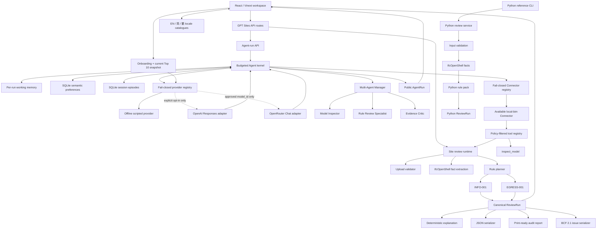

# Technical Architecture — Implemented Baseline

## Architectural claim

The currently implemented runtime is a deterministic Python review core with a React/Vinext product surface and a Python CLI/reference surface. The Site runtime is the primary product UX; both runtimes are checked against the same canonical review contracts:

1. the deterministic baseline executes the fixed review workflow directly; and
2. the single-Agent or Manager-team path executes a provider-independent action loop in which the offline scripted policy or an explicitly selected OpenAI Responses/OpenRouter adapter requests registered tools/specialists, receives schema-valid observations, and selects its next action.

The second path is a real orchestration kernel. Its local Provider keeps action selection deterministic and reproducible; both optional external adapters are disabled by default and contract-tested through injected fake transports rather than paid service calls. OpenRouter adds an atomically refreshed, allowlisted weekly Top 10 of models supporting `tools` and `tool_choice`; the browser makes this choice through a skippable onboarding and persistent Provider/model switcher. An independent Connector registry determines which approved capability sources may materialize tools for the selected Agent team. A dependency-free browser i18n layer projects the workspace in English, Simplified Chinese, or Traditional Chinese without changing canonical evidence. The React browser workbench renders the resulting public `AgentRun` and separately loads its linked canonical `ReviewRun`.

The implemented vertical slice now includes scoped durable sessions and bounded, redacted episodic recall. The fuller product target adds resumable execution checkpoints, approval/clarification state, production scheduling, and executable external connectors. See [BIM Review Agent System Architecture](AGENT_SYSTEM_ARCHITECTURE.md). The current and target descriptions remain separate so repository claims never outrun implemented code.

## Trust boundaries

1. Uploaded bytes are untrusted until the validator accepts extension, size, STEP header, and parser result.
2. IFC extraction produces facts and provenance; it cannot assign a review status.
3. Rules consume facts plus a versioned YAML rule pack and are the only status authority.
4. The canonical `ReviewRun` is the sole source for browser findings, verdict summaries, JSON download, print-ready report, and BCF issue package. The separate `AgentRun` supplies runtime state/events only; export routes do not rerun rule logic.
5. Explanation is downstream. Its absence or failure cannot block or change deterministic review.
6. The Agent provider may request only tools exposed by the current Agent definition; the kernel validates action, input, output, budget, and policy before an observation enters the trajectory.
7. `run_deterministic_review` links the Agent result to one canonical `ReviewRun`; the Agent cannot create or edit its findings.
8. Semantic memory accepts only allowlisted preferences, preserves exact user/project scope and provenance, and cannot store IFC bytes, arbitrary claims, rule parameters, or credentials.
9. Session memory retains only bounded, redacted episode metadata. A run may recall the newest three episodes from the same session; session scope mismatch fails closed, and explicit forget hard-deletes the session and its episodes.
10. Session continuity is not execution resumability: no persisted message stack, pending task graph, approval state, or interrupted tool call is restored.
11. The Manager passes each specialist only a bounded objective and role-specific tool context. Specialists have one-tool allowlists, no recalled memory, and no nested-delegation budget.
12. Model inspection and deterministic review may run concurrently; evidence criticism cannot run until the scheduler has a canonical `ReviewRun` reference.
13. `auto` always resolves to the local scripted Provider. External routing requires explicit enablement, a configured credential environment variable, and an explicit request `provider_id`; OpenRouter additionally requires a current approved `model_id`.
14. External adapters receive safe structured context rather than IFC bytes, validate function calls, and reject a final review ID that no deterministic tool or specialist produced. Responses requests set `store: false`; OpenRouter requests require parameter-compatible, no-data-collection, ZDR-capable routing.
15. Reading `/api/providers/openrouter/models` never refreshes over the network. Only the explicit refresh POST may replace the ten-model snapshot, and a malformed or failed refresh leaves the last valid snapshot active.
16. Provider selection and Connector selection are orthogonal: the Provider chooses a typed action, while the selected Connector set limits which tool schemas and handlers exist for that run.
17. Only `local-bim` is executable. `external-http` is disallowed and `mcp-server` is disabled; neither placeholder can register an endpoint or execute a request.
18. Manager and child runs record the inherited Connector IDs through `connector.selected`, so specialist delegation cannot silently expand capability sources.
19. Interface localization is a presentation boundary. Locale catalogues may translate static chrome, known lifecycle states, and deterministic trace descriptions, but they never mutate `AgentRun`, `ReviewRun`, IFC facts, rule evidence, verdicts, source paths, thresholds, or export payloads. The independent semantic `explanation_language` preference controls future Agent prose rather than the interface locale.

## Current runtime shape

- Python `>=3.11,<3.15`.
- The Python package exposes the reference evaluator through `bim-review-agent review` and `bim-review-agent validate-schema`. The primary browser product is the React/Vinext workbench under `apps/gpt-sites`, which calls the typed GPT Sites API routes and does not reimplement the Python CLI.
- IfcOpenShell 0.8.5 parses IFC and exposes entity/property facts.
- Pydantic validates all public result contracts.
- The Agent runtime uses typed Agent definitions, discriminated actions, public events, tool schemas, tool/step budgets, and explicit terminal stop reasons.
- The provider registry publishes credential-free metadata for `scripted`, `openai-responses`, and `openrouter`, including enabled/configured/availability state, sanitized endpoint origin, model-selection support, and a model-catalogue endpoint where applicable.
- The `scripted` Provider is local and deterministic. Both optional external adapters convert native function calls into the same typed tool, delegation, and final actions without executing those actions themselves.
- `OpenRouterCatalogueService.current()` is network-free and starts from a dated ten-model fallback. `refresh()` validates model ID, name, context, price, and required parameters before one atomic in-process replacement.
- The Connector registry publishes kind, version, external/network flags, configuration, policy approval, availability, health, capabilities, and effects. It resolves selections before execution and materializes only the declared tool subset.
- The bundled `local-bim` Connector exposes model inspection, deterministic review, and evidence critique. HTTP/MCP entries are explicit non-runnable boundaries, not implemented integrations.
- SQLite persists allowlisted user/project preferences with correction chains and explicit hard-delete. Recalled records enter the public trace with their memory ID and scope.
- SQLite also persists exact-scope sessions and capped episode summaries: 20 sessions per user/project, 20 episodes per session, and the newest three recalled. Episodes omit source bytes, filenames, prior objective/final prose, and finding bodies.
- The generic Agent kernel accepts typed delegation actions, enforces specialist allowlists and parallel/total budgets, validates one child result per task, and publishes child lifecycle events.
- The BIM scheduler implements manager-as-owner orchestration for Model Inspector, Rule Review Specialist, and Evidence Critic with a maximum of two concurrent children.
- The browser selects deterministic, single-Agent, or Manager-team execution; provides first-run model onboarding plus Provider/Model/Connector controls; separates working, semantic, and episodic memory; supports clean-session and hard-forget actions; and renders the public event timeline without raw tool outputs or private chain-of-thought.
- `apps/gpt-sites/app/components/review-app.tsx` owns the primary React workbench: fixed app shell, collapsible sidebar, setup/running/findings/runs/rules/samples views, evidence Inspector, locale switching, export, print, deletion, and responsive state transitions. It consumes the existing `ReviewRun/v1`, `AgentRun`, and storage contracts.
- YAML stores project rule parameters and authority labels.
- A bounded in-memory store supports the local demo; a process restart clears prior runs.
- The React surface is built with Vinext/Vite and keeps its dependencies local; no CDN is required.
- The standard library BCF serializer emits deterministic BCF 2.1 textual topics for `FAIL` and `REVIEW`; it does not invent missing geometry/viewpoints.

## Frontend boundary

React/Vinext is the product-facing web surface. Its responsibility is navigation, state projection, evidence-oriented interaction, and accessibly presenting API results. It may select a finding, filter a list, open a trace, or initiate an export, but it must not assign a verdict, calculate a threshold, parse IFC bytes, or invent an observation.

The Python runtime remains the reference evaluator and the source of deterministic `ReviewRun` evidence. It is intentionally CLI/reference-only; all browser product flows belong in React/Vinext and are covered by the Site test and browser gates. See [Python web retirement ADR](ADR-2026-08-13-retire-python-web-compat.md) and the [public assignment boundary](../source/HKU_ASSIGNMENT_BRIEF.md).

The React release gate includes typecheck, lint, production build, contract/equivalence tests, keyboard/focus checks, no-horizontal-overflow checks at 375/768/1024/1440 widths, and browser verification of setup, running, findings, export, print, deletion, empty, and error states.

## Determinism

Run IDs and timestamps vary by execution. Finding identity, applicability, normalized observations, rule evidence, statuses, messages, and recommended actions must remain equivalent for the same IFC bytes and rule-pack version.

The test suite compares a deterministic projection that excludes runtime metadata.

Agent trajectory tests use the scripted provider to prove that an observation changes the following action, unauthorized tools fail closed, malformed inputs/outputs are rejected, and repeated calls stop at a configured budget.

Locale tests enforce identical non-empty keys and interpolation placeholders across all three React catalogues and exercise static catalogue delivery. Browser QA additionally verifies refresh persistence and state-preserving live switching; canonical run equivalence is unaffected because localization never enters the review orchestrator.

BCF topic GUIDs are UUIDv5 values derived from the run and finding IDs. ZIP metadata is fixed to the run completion time, so repeated export of one retained run is byte-for-byte stable. See [BCF 2.1 Export Contract](BCF_EXPORT.md).

## Error strategy

| Boundary | Error response | User recovery |
|---|---|---|
| Unsupported file | `400` structured API error | Select a `.ifc` file |
| File too large | `413` structured API error | Export a smaller review model |
| Invalid STEP/IFC | `422` structured API error | Re-export or choose a bundled sample |
| No actionable finding for BCF | `422` structured API error | Retain the all-pass run as JSON or audit report |
| Unknown sample/run/session | `404` | Return to the workspace and choose an available sample or create a clean session |
| Internal rule fault | Run records failed stage; API returns controlled error | Inspect logs/tests; no fabricated successful result |
| Invalid Agent/provider action | Terminal `AgentRun` with a typed failure reason | Inspect public events and correct provider/tool contract |
| Agent loop or tool-call excess | Terminal `BUDGET_EXHAUSTED` state | Narrow the objective or adjust an explicit Agent budget |
| Invalid or arbitrary memory | `422` structured API error | Choose an allowlisted key/value and exact scope |
| Forgotten memory | Hard-deleted record no longer recalls | Recreate the preference explicitly if still wanted |
| Session scope mismatch | `403` structured API error | Use the session's original user/project scope or create a new session |
| Forgotten session | Session and episodes are hard-deleted | Create a new session; deleted context is not recoverable through the application |
| Unknown Provider | `404` structured API error | Choose a `provider_id` returned by `/api/capabilities` |
| Disabled or incompletely configured Provider | `503` structured API error | Keep using `scripted`, or explicitly complete opt-in configuration and restart |
| Malformed or unapproved model | `422` structured API error | Choose a `model_id` from the selected Provider's current `models_endpoint` |
| Live model catalogue refresh fails | `503` structured API error; prior snapshot remains active | Continue with the visible snapshot and retry the explicit refresh later |
| Unknown Connector | `404` structured API error | Choose a `connector_id` returned by `/api/capabilities` |
| Disallowed Connector | `403` structured API error | Use an approved capability source; the Agent cannot broaden policy |
| Disabled/unavailable Connector | `503` structured API error | Use `local-bim` or configure and separately approve a typed adapter |
| Connector lacks an Agent capability | `422` structured API error | Select a source that declares every required tool capability |

## Current implementation omissions

- Scoped session continuity and redacted episodic recall are implemented; resumable execution checkpoints, approval/clarification state, and interrupted-run recovery are not.
- The browser presents only terminal completed/failed runs; it has no streaming, pause/resume, approval, or active cancellation controls yet.
- No server database, authentication, cloud storage, or external telemetry; local SQLite is used only for allowlisted preferences and redacted session/episode metadata.
- No 3D viewer in the assessment slice; evidence clarity has priority over geometry spectacle.
- No remote AI dependency exists in the default runnable path. The Responses and OpenRouter adapters have no live-inference quality, cost, latency, or reliability measurement yet; the public OpenRouter catalogue refresh is not an inference test.
- No executable external business API or MCP Connector; registry health is static metadata rather than an active probe.
- No legal claim attached to the bundled 900 mm demo threshold.
