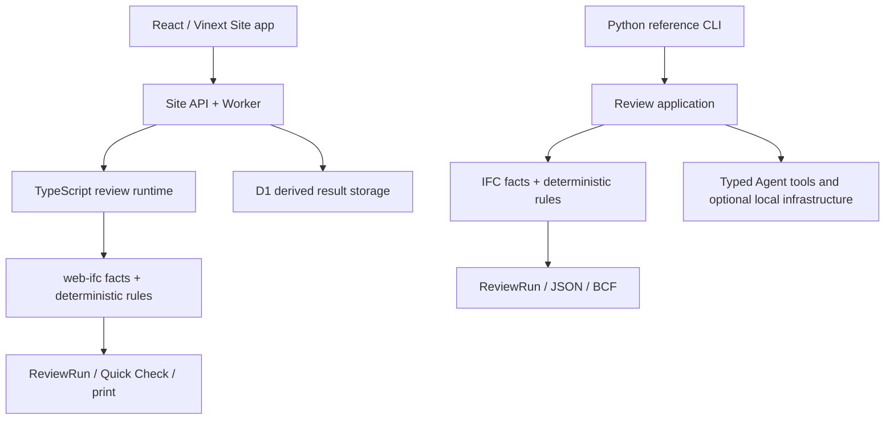

# Codebase Structure

这份文档是当前仓库的代码组织地图。它回答“一个改动应该放在哪里”，不取代
[技术架构基线](ARCHITECTURE.md) 或 [Agent 系统架构](AGENT_SYSTEM_ARCHITECTURE.md)。

## 一张图理解当前项目



图中的四层是当前已经落地的 MVP：接口层接收 React/GPT Sites、CLI 和 IFC 上传；应用层
编排 Review service、Agent kernel 和 BIM tools；领域层负责 IFC facts、确定性规则、证据模型
和 BCF；基础设施层提供 Provider、SQLite memory、Connector、配置与存储。右下角虚线框是
后续路线，不应当被当作当前已实现的摄像头、机器人或嵌入式节点能力。

## 当前分层

```text
src/bim_review_agent/
├── domain/                  # 业务事实、证据、规则和互操作格式
│   ├── models.py            # ReviewRun、Finding、Observation 等稳定契约
│   ├── errors.py            # 领域输入错误
│   ├── ifc/                 # IFC 解析与事实提取
│   ├── rules/               # 确定性规则与版本化规则包
│   ├── exports/             # BCF 2.1 导出
│   └── samples.py           # 合成样例目录与加载
├── application/             # 用例编排，不负责 HTTP/CLI 细节
│   ├── review_service.py    # 上传校验、提取、规则评估、解释
│   ├── explainer.py         # 下游解释附加
│   ├── agent/               # Agent kernel、trajectory、specialist 调度
│   │   └── orchestration/   # BIM 专家角色与并行调度
│   └── tools/               # Agent 可见的类型化 BIM 工具
├── infrastructure/         # 可替换适配器和持久化实现
│   ├── config.py            # 环境变量到 Settings
│   ├── connectors.py        # Connector catalogue 和 fail-closed 策略
│   ├── providers/           # scripted、Responses、OpenRouter
│   ├── memory/              # SQLite 偏好、session、episode
│   └── storage.py           # 运行记录与存储 wiring
├── interfaces/              # 进入系统的交付边界
│   └── cli.py               # `bim-review-agent review/validate-schema`
└── assets/                  # 包内只读规则 YAML 和合成 IFC 样例
```

仓库级目录仍然按交付责任分组：

```text
docs/          产品、技术、评估、演示与提交文档
docs/source/private/  本地原始方案归档；被 .gitignore 忽略，不是执行 PRD
contracts/     机器可读 API/Agent/规则契约
prompts/       可审计的可选解释提示词
scripts/       样例、合同、提交包等可复现工具
tests/         单元、合同、集成与提交包安全测试
apps/gpt-sites React / GPT Sites / Vinext 主交付壳层
videos/        HyperFrames 视频工程与素材清单
design-system/ UI 设计令牌与实现约束
local-delivery/ 本地生成的交付物；被 .gitignore 忽略
```

## 依赖方向

当前代码遵循以下可检查的方向：

```text
interfaces → application → domain
infrastructure → application contracts + domain
```

- `domain` 不应导入 HTTP/UI 框架、SQLite、Provider SDK 或环境配置。
- `application` 可以组合领域服务和类型化端口，但不应解析 HTTP 请求或直接读写网页资源。
- `infrastructure` 实现 Provider、Memory、Connector、配置和存储；默认 scripted/local 路径保持离线。
- `interfaces` 只负责 CLI 输入校验、调用用例和映射终端/JSON 输出。
- `apps/gpt-sites` 只消费稳定 API/契约，不导入 Python 私有模块，也不复制 IFC 解析和规则判断。
- `assets` 通过 `importlib.resources` 从包内加载，避免依赖当前工作目录。

现阶段 Agent kernel 仍通过稳定的 `infrastructure.*` 契约使用 Provider/Memory，这是可运行的
MVP 边界。后续若需要第三方 Provider 热插拔，再把这些契约抽到 `application/ports/`，不应
把 SDK 依赖倒灌进 `domain`。

## 常见改动放置规则

| 改动 | 位置 | 例子 |
|---|---|---|
| 新的 IFC 事实或证据字段 | `domain/models.py`、`domain/ifc/` | 增加可追溯的门事实 |
| 新的确定性审查规则 | `domain/rules/` + `assets/rules/` | 新增规则 ID 与 YAML 参数 |
| 新的审查用例 | `application/` | 组合现有规则，不在路由中复制逻辑 |
| 新的 Agent 工具 | `application/tools/` | 输入/输出模型、effect、registry wiring |
| 新的模型 Provider | `infrastructure/providers/` | 适配到统一 Provider contract |
| 新的外部能力来源 | `infrastructure/connectors.py` | 先声明能力/权限，再实现 handler |
| 新的 Python CLI 行为 | `interfaces/cli.py` | 调用 application 用例；不要在 CLI 中复制规则逻辑 |
| 新的 React/GPT Sites 交互 | `apps/gpt-sites/` | 主产品工作台通过 runtime API 调用，不复制 Python 规则 |
| 新的视频交付证据 | `videos/`、`docs/demo/` | 不把录屏临时缓存放进源码树 |

## 入口与运行命令

```bash
# 直接审查一个 IFC 并输出 JSON
uv run bim-review-agent review path/to/model.ifc

# 验证 IFC4 schema profile
uv run bim-review-agent validate-schema path/to/model.ifc
```

Python 包入口固定为 `bim_review_agent.interfaces.cli`，Site-native 浏览器入口位于
`apps/gpt-sites`。Python Web 兼容层已于
[ADR-2026-08-13](ADR-2026-08-13-retire-python-web-compat.md) 移除；外部脚本如果直接调用
`serve` 或导入 `interfaces.web` 需要迁移到 Site app 或 CLI。

## PRD 与代码的对应关系

当前代码以公开作业范围和确定性 BIM Review vertical slice 为执行基线；能力自适应硬件
运行时和更广泛 GPT Sites 体验仍是后续边界，不会因为目录预留就被误称为已实现。
